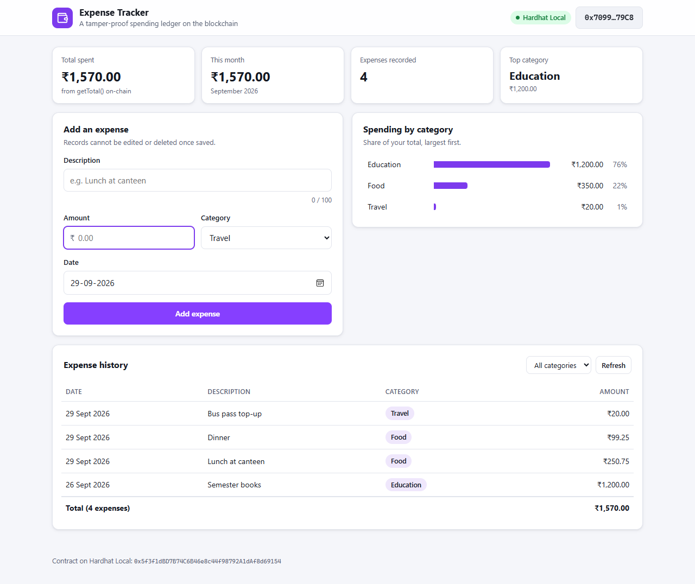
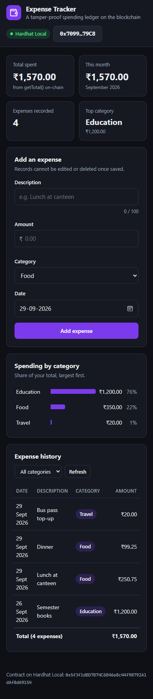

# Blockchain-Based Expense Tracker

Record personal expenses on **Monad Testnet**. Every wallet has its own ledger. Records
are **append-only**: once an expense is saved it cannot be edited or deleted, so the
history cannot be tampered with.



## Features

| Requirement | How it is done |
|---|---|
| Record personal expenses | Stored per wallet (`mapping(address => Expense[])`) |
| Add an expense and amount | `addExpense(description, category, amount, date)` |
| View expense records | `getExpenses()` returns your list. The page shows it newest first, with a category filter |
| Calculate total expenses | `getTotal()` returns a running total kept by the contract. The page also shows this month's total and a chart of spending by category |

### How amounts are stored

Solidity has no decimal numbers, so amounts are stored as whole **paise**
(1 rupee = 100 paise). The page converts for you, so ₹250.75 is sent as `25075` and
shown back as `₹250.75`. It does this with exact integer maths, never floating point,
so totals never drift.

The date is the day the money was spent. You can back-date an expense, but a future
date is rejected. Sending `0` means "now".

## Smart contract: `contracts/ExpenseTracker.sol`

| Function | What it does |
|---|---|
| `addExpense(string description, string category, uint256 amount, uint256 date) → uint256 id` | Records an expense (amount in paise, more than 0) |
| `getExpenses() → Expense[]` | All your expenses: id, description, category, amount, date, recorded time |
| `getTotal() → uint256` | Sum of all your expenses, in paise |
| `getExpenseCount() → uint256` | How many expenses you have recorded |
| `getTotalByCategory(string category) → uint256` | Sum for one category |

Event: `ExpenseAdded(user, id, category, amount, date)`.

## Important: blockchain data is public

Each wallet can only add to its own ledger, but anyone reading the blockchain can see
the amounts. Use a test wallet, and do not record anything you want to keep private.

## Run it

Do the one-time setup in the [main README](../README.md) first. Then:

```powershell
npm test               # 6 contract tests
npm run deploy:monad   # deploy to Monad Testnet (or: npm run node + npm run deploy:local)
npm start              # open http://localhost:5505
```

## Demo script

1. Connect a wallet and add a few expenses in different categories. Back-date one of them.
2. Show **Total spent**, which comes directly from `getTotal()` on-chain, and the
   *Spending by category* chart.
3. Filter the history by one category. The footer shows that category's total.
4. Try an amount of `0` (rejected by the page), or a future date (rejected by the contract).
5. Switch to another MetaMask account. Its ledger is empty, because every wallet's
   records are separate.



## Tests (`npm test`)

- Adding stores every field and emits the event
- A date of `0` uses the block time
- Empty or long text, a zero amount and future dates are rejected
- The running total, count and per-category total are correct, and the total equals the sum of the list
- Each wallet's ledger and IDs are separate
- Very large amounts add up without overflow
